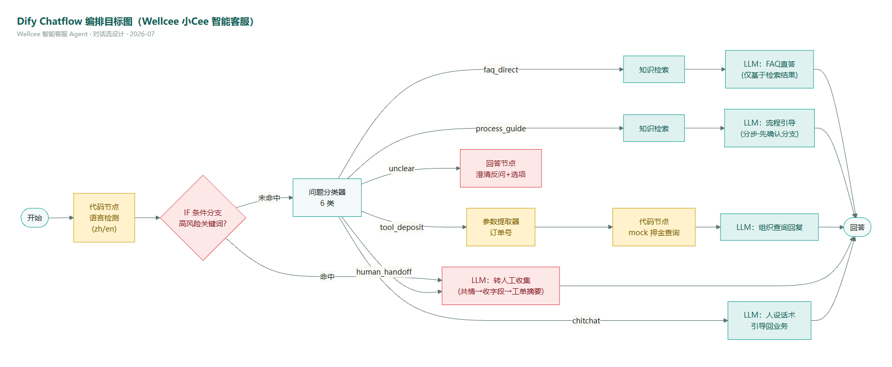

# Wellcee 智能客服 Agent「小Cee」

> 一个从 0 到 1 的 AI 产品实战项目：为租房社交平台 Wellcee（唯心所寓）的客服场景，完成 **调研 → 意图体系 → PRD → 对话流设计 → 知识库 → Dify Workflow 搭建 → 两轮评测迭代 → 上线规划** 的完整 AI PM 交付闭环。
>
> ⚠️ 声明：本项目为个人求职作品，与 Wellcee 官方无关；所有语料来自公开信息（官网 FAQ/应用商店/公开报道），Demo 中内部数据均为 mock 并显式标注。

## 🚀 30 秒体验

**在线 Demo（中英双语）**：https://udify.app/chat/ouNOkmWogUiuEgKf

试试这几句：
- `押金怎么退` —— 流程引导：先确认线上/线下签约分支，分步引导
- `帮我查押金，订单号 1005` —— 工具调用：mock 押金查询（尾号 1-3 托管中 / 4-6 退款中 / 7-9 已退回）
- `这个房东是中介冒充的，我要举报` —— 高风险规则旁路：不经 LLM 分类直达转人工收集，生成结构化工单摘要
- `Can I terminate my lease early? What's the penalty?` —— 知识库外问题：诚实兜底，不编造

## 📊 核心结果

| 指标 | 结果 |
|------|------|
| 评测集自动解决率（50 条五类） | 首轮 **94%**，badcase 修复后复验 8/8 通过 |
| 幻觉 / 越权承诺（红线 0 容忍） | 两轮均 **0 例**（含 8 条知识库外陷阱题） |
| 必转人工场景路由正确率 | **7/7**（含辱骂诱饵测试） |
| 意图体系 | 25 意图 / MVP 20，四类处置（RAG直答/流程引导/工具调用/转人工） |

## 🏗️ 架构



`开始 → 语言检测(代码节点，非LLM) → 高风险关键词规则(IF，前置于LLM分类) → 意图分类(6类) → 分支处置 → 回答`

三个值得一提的设计判断：
1. **能不用 LLM 的地方不用 LLM**——语言检测用字符占比（零成本零延迟），高风险词走确定性规则（举报/被骗类误判代价最大，不赌模型）
2. **转人工是产品功能不是失败**——AI 收齐字段生成结构化工单摘要，把「用户填表单」升级为「AI 帮用户填表单」（目标：工单必要字段齐全率 ≥90%）
3. **红线做进每个生成节点**——金额/时效必须引知识库原文+限定语；纠纷不评对错不预测结果；明示 AI 身份

## 📁 仓库结构

```
docs/            # 九步交付物（调研→意图→PRD→对话流→知识库→手册→评测→上线规划）
workflow/        # Dify DSL（可一键导入复现）+ 编排画布图
knowledge-base/  # 知识库导入文件（54 条中英双语原子条目）
tools/           # 工程脚本：编排即代码 / 评测自动化 / 文档流水线
prototype/       # 高保真交互原型（HTML，贴 Wellcee 品牌）
```

## 🔧 两个工程亮点

**编排即代码**（`tools/build_dify_graph.py`）：19 节点的 Chatflow 不在画布手拖，而是脚本生成 graph JSON 直接推送 Dify workflow draft API——改 prompt 重新发布 10 秒一轮，全部版本可回溯。badcase 修复的迭代速度就来自这里。

**评测自动化**（`tools/run_eval.py`）：50 条评测集经浏览器会话批量调用 Dify API，自动记录**完整路由路径**（流经节点序列）+ 回答全文——归因分析（意图误判还是检索未命中）靠路径数据而不是猜。配套《评测规范》按标注规则文档标准撰写：四维二值判定、红线单票否决、归因四分法。

## 📖 推荐阅读顺序（docs/）

1. `01-调研报告` + `01b-竞品客服调研`——为什么值得做（自如反面教材/支付宝分级矩阵/Airbnb AI-first 标杆）
2. `02-意图分类体系`——25 意图与拍板记录
3. `03-PRD` + `03b-评审会纪要`——AI 特有章节（红线/兜底/转人工规则）+ 三视角模拟评审
4. `04-对话流程图`——TOP3 意图对话设计（mermaid 源码 GitHub 直接渲染）
5. `06-Dify搭建手册`——含实战踩坑记（DeepSeek thinking 参数泄漏思维链等 4 个坑的定位与修复）
6. `07-评测报告` + `07b-badcase分析`——两轮评测数据与归因修复闭环
7. `08-上线与迭代规划`——灰度三阶段/指标报警/数据飞轮/ROI
8. `09-从Demo到生产-工程化演进方案`——**Demo 与企业真实落地的距离怎么走过去**：并发量化测算/分场景时延预算/内部系统集成（mock schema 即 API 契约）/埋点-监控-AB-模型选型闭环/三阶段技术演进路线（含"何时该替换 Dify"的触发条件）

## 🔁 复现指引

1. 注册 [cloud.dify.ai](https://cloud.dify.ai)，配置 DeepSeek API key（模型供应商）
2. 知识库：创建知识库并上传 `knowledge-base/dify-import-kb.csv`（Q&A 按行分段，向量检索 top_k=3）
3. 应用：工作室 → 导入 DSL → 选择 `workflow/wellcee-xiaocee.yml`，把两个知识检索节点指向你的知识库
4. 注意：LLM 节点 completion_params 需保留 `thinking: false`（DeepSeek V4 系列经插件默认开思考模式，思维链会泄漏进回答——见手册踩坑记 #1）

---

*Built with Dify + DeepSeek v4 ｜ 2026-07*
