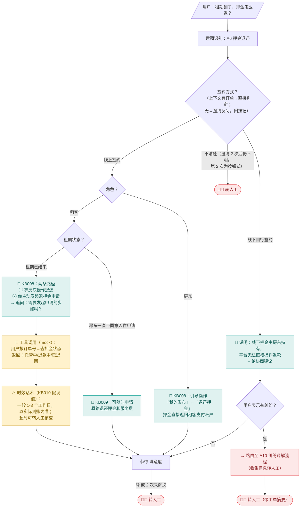
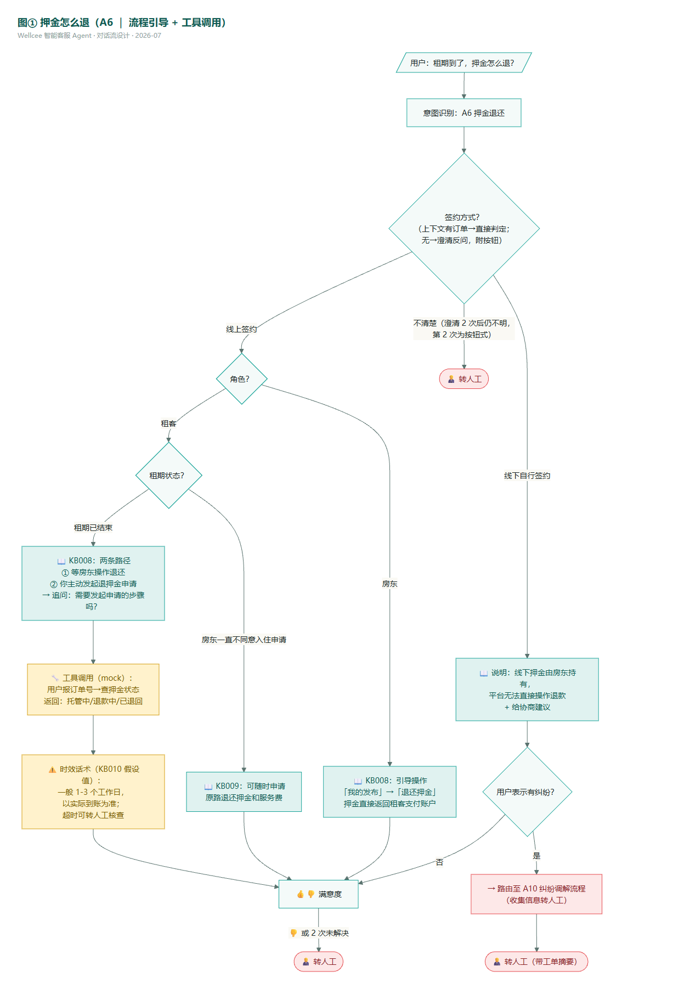
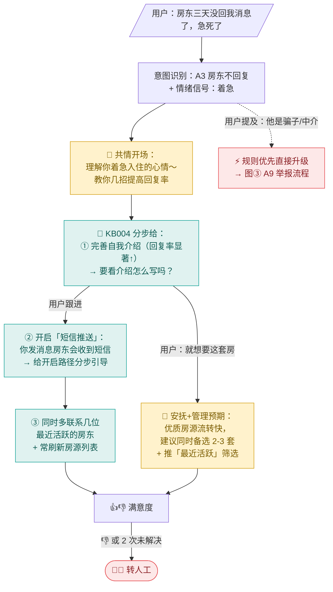
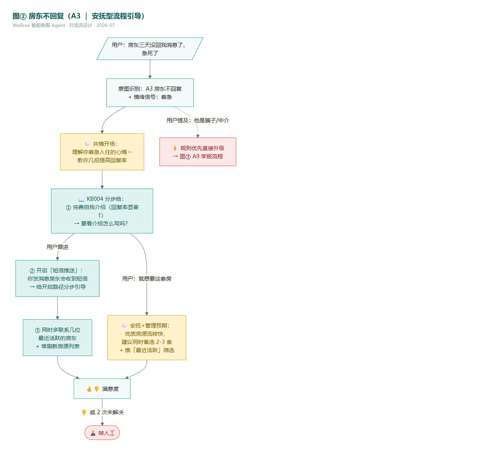
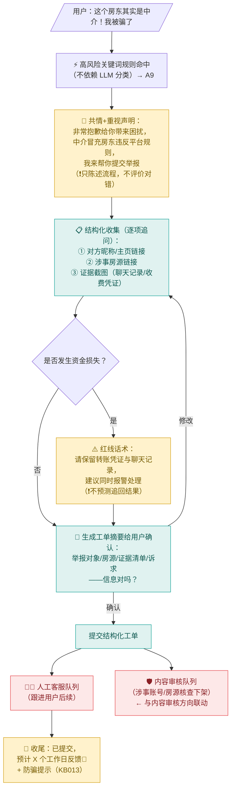
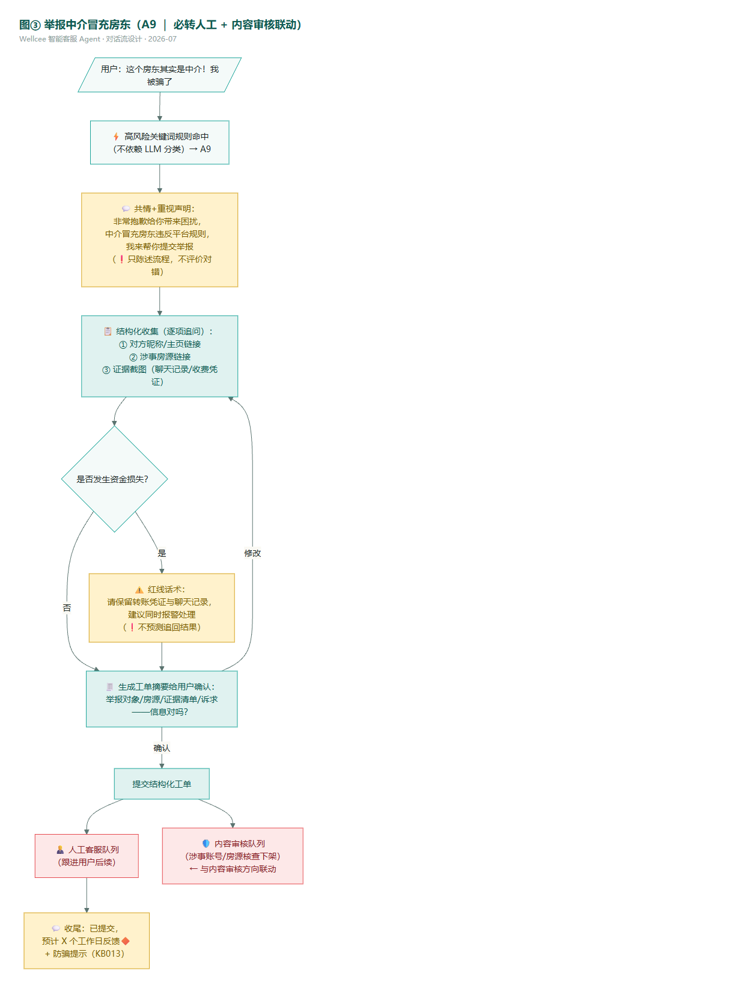

# 对话流设计：TOP3 意图流程图（Step 4.3/4.4 交付物）

> 2026-07-08 ｜ 图为 conversation design（对话设计），不是业务流程图——节点是"AI 说/问什么"，分支是"用户怎么答"。
> 三张图对应三种代表性处置类型：**流程引导+条件分支**（押金退还）/ **安抚型引导**（房东不回复）/ **必转人工+信息收集**（举报中介，展示与内容审核的联动）。
> 通用规则（三图共享，不重复画）：「转人工」按钮全程常驻；同一会话累计 2 次未解决自动建议转人工；每次解决后出 👍👎 满意度。

---

## 图① 押金怎么退（意图 A6 ｜ 流程引导 + 工具调用）

**设计要点**：先分"线上签约/线下签约"——这是答案完全不同的分水岭；线上再分角色（租客/房东操作路径不同）；"多久到账"是假设值，话术强制带"以实际到账为准"限定语（法务红线 L1）。

## 图② 房东不回复（意图 A3 ｜ 安抚型流程引导）

**设计要点**：这是情绪型咨询——用户要的不只是方法，是"被理解"。开场先共情再给建议；建议拆步骤逐条给（不一次灌满）；用户提到"骗子/中介"立即升级路由到 A9（高风险词规则优先）。

## 图③ 举报中介冒充房东（意图 A9 ｜ 必转人工 + 与内容审核联动）

**设计要点**：高风险意图**不走 LLM 分类**，命中关键词（中介/骗/举报）规则直进本流程（评审修订 R1）；AI 全程只收集不评价（法务红线 L4：禁止"这种情况一般能退/他肯定是骗子"式表述）；产出是一张结构化工单，同时喂给人工客服和内容审核队列——这是客服 Agent 与 JD 里"内容审核"方向的联动点。

---

## 关键 UX 决策记录（Step 4.4，面试讲述用）

| # | 决策 | 为什么（面试版答案） |
|---|------|---------------------|
| 1 | 答案气泡展示"来源"角标（引知识库条目） | ① 用户信任：看得见依据的回答可信度高 ② 可追溯：答错了能定位到知识库条目改正（归因四分法的前提）③ 法务：金额/时效类回答必须引原文，来源展示是红线的 UI 载体 |
| 2 | 转人工前先结构化收集信息 | 不是拦着用户，是让转过去的工单**必要字段齐全率 ≥90%**：客服不用再来回补问，单均处理时长下降——AI 没解决问题时也在创造价值 |
| 3 | 高风险意图走关键词规则优先，不依赖 LLM 分类 | 举报/纠纷场景误判代价最大（用户在气头上被 AI 绕圈=事故）；规则命中是确定性的，LLM 只兜底长尾问法 |
| 4 | 「转人工」按钮常驻、零门槛 | 与用户博弈"逼 TA 和 AI 聊"是对话产品最差体验；AI 的价值在转之前把信息收齐，不在拦截率数字好看 |
| 5 | 情绪型意图（A3）先共情再给方案 | 用户要的是"被理解"再"被解决"；直接甩三条建议=像 FAQ 机器人，共情开场是"像人工客服"的分界线 |
| 6 | 澄清反问附按钮选项（而非纯开放追问） | 按钮是确定性的：一次点击完成歧义消解，比"你能再说清楚一点吗"少一轮对话、零理解失败风险（拍板 A 定版：最多 2 次，第 1 次开放式、第 2 次强制按钮式） |
| 7 | 时效/金额类回答强制带"以实际为准"限定语 | 法务红线 L1：AI 说"1-3 天到账"没到账，用户拿截图闹=平台违约风险；限定语+假设值🔶标注是防御设计 |

## 与原型的关系

高保真原型（`Wellcee智能客服-高保真原型.html`）演示的是**界面长什么样**（入口/气泡/快捷问题/满意度控件）；本文档三张图定义的是**对话怎么走**（分支/追问/转人工时机）。Step 6 Dify 编排时：图① = 条件分支+工具调用节点的蓝本，图② = 多轮 prompt 设计蓝本，图③ = 转人工分支+工单摘要生成的蓝本。
