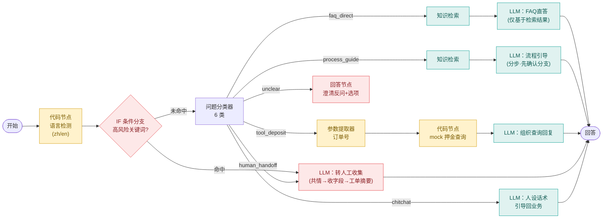

# Dify 搭建手册：Wellcee 智能客服「小Cee」Chatflow

> Step 6.0 交付物 ｜ 2026-07-08 ｜ 蓝本：PRD v1.0 §5.2 + 对话流程图①②③ + knowledge-base.xlsx
> **这份手册是什么**：把 PRD 翻译成 Dify 上可逐步执行的搭建指令。你照着搭（面试会被问操作细节），每个设计都附"为什么"（面试答案）。
> 界面按 Dify 云版（cloud.dify.ai）当前版本描述，若按钮名称略有出入，找同义功能即可。

---

## 0. 你将搭出什么




**对应关系**：这张图 = PRD 5.2 的 Dify 落地。四类处置（FAQ直答/流程引导/工具调用/转人工）+ 澄清反问 + 闲聊人设，共 6 条分支；高风险关键词规则在分类器**之前**（评审修订 R1：强规则优先于 LLM 分类）。

---

## 1. 环境准备（对应看板 #8，你本人做，约 5 分钟）

1. 浏览器打开 `cloud.dify.ai` → 注册/登录（GitHub 或邮箱均可）
2. 右上角头像 → **设置 → 模型供应商** → 找到 **DeepSeek** → 填入你的 API key → 保存
3. 确认两个模型可选：`deepseek-v4-flash`（轻任务：分类）与 `deepseek-v4-pro`（生成任务）。Demo 全程用 flash 也可以（更便宜），本手册默认：**分类器用 flash、其余 LLM 节点用 pro**
   💡 为什么分开：分类是短输入短输出的判别任务，flash 足够且快；面向用户的生成回答用 pro 保证语言质量——"按任务选模型"本身是面试可讲的成本意识。

## 2. 知识库导入与检索单测（对应看板 #9）

### 2.1 导入
1. 顶栏 **知识库** → **创建知识库** → 命名 `wellcee-kb-v1`
2. 上传文件：选择 `06-Demo搭建/dify-import-kb.csv`（已为你生成：54 行 = 27 条中文 + 27 条英文，question/answer 两列）
3. 分段设置：选 **Q&A 分段模式**（若版本无此项，用"自定义分段"，分隔符按行）——一行 = 一个问答对 = 一个检索单元
   💡 为什么：我们在 Step 5 已经做过原子化切分（13 条官方 FAQ 拆 27 条），Dify 里不需要再自动分段，保住切分边界就是保住检索精度
4. 索引方式：**高质量**（向量检索）；Embedding 模型用默认
5. 检索设置：**向量检索**，top_k = 3，score 阈值先不设（单测后再调）

### 2.2 检索单测（10 问，导入完成后在知识库「召回测试」里逐个试）

| # | 测试问题 | 应命中条目 | 过关标准 |
|---|---------|-----------|---------|
| 1 | 押金退了多久到账 | KB010 | 首位命中 |
| 2 | 房东一直不回我消息 | KB004 | 首位命中 |
| 3 | Who holds my deposit? | KB007(EN) | 前 3 命中 |
| 4 | 还没看房就让我打钱 | KB013 | 首位命中 |
| 5 | 怎么把房子挂上去 | KB016 | 前 3 命中（口语化变体） |
| 6 | 学生认证审核不过 | KB002 | 前 3 命中 |
| 7 | 收不到短信验证码 | KB001 | 首位命中 |
| 8 | listing was removed | KB019(EN) | 前 3 命中 |
| 9 | 你们平台咋收费 | KB021 | 前 3 命中 |
| 10 | 可以开发票吗 | （知识库外） | 命中分数应明显偏低——这条是负样本 |

记录结果：命中率 <8/10 时调整——① top_k 升到 5 ② 检查 CSV 是否按 Q&A 模式分段 ③ 换混合检索（向量+关键词）。**把首轮命中率记下来**，这是 Step 7 评测报告里"检索质量基线"的素材。

## 3. 创建 Chatflow 与逐节点搭建（对应看板 #10）

顶栏 **工作室** → **创建空白应用** → 类型选 **Chatflow** → 命名 `Wellcee小Cee智能客服`。

### 节点 1｜开始（自带，不用动）

### 节点 2｜代码执行：语言检测
「开始」后加 **代码执行** 节点，命名 `语言检测`，Python3，输入变量 `query` ← 绑定 `sys.query`：

```python
def main(query: str) -> dict:
    zh = sum(1 for c in query if '一' <= c <= '鿿')
    ratio = zh / max(len(query.strip()), 1)
    return {"lang": "zh" if ratio > 0.15 else "en"}
```

输出变量：`lang` (String)。
💡 为什么用代码不用 LLM：字符占比判断零成本、零延迟、100% 稳定——"能不用 LLM 的地方不用 LLM"是 AI PM 的工程判断（面试点）。阈值 0.15 意味着中英夹杂（"押金 refund 多久"）按中文处理，符合国内用户习惯。

### 节点 3｜IF/ELSE：高风险关键词规则
加 **条件分支** 节点，命名 `高风险规则`。条件（`sys.query` **包含**，多条件 **OR**）：

`举报`、`被骗`、`骗子`、`诈骗`、`冒充`、`投诉`、`不给退`、`退不了`、`报警`、`人工`、`scam`、`fraud`、`report`、`human agent`

- **IF 命中** → 直连节点 8（转人工收集），跳过分类器
- **ELSE** → 节点 4（问题分类器）

💡 为什么这些词、为什么不放"中介"：高精度强信号词才进规则（说"被骗/举报/报警"的用户几乎不可能是来问 FAQ 的）；"中介"这类模糊词交给分类器——"你们平台真的无中介吗"是 FAQ，不是举报。规则收精度、模型收召回，两层互补（评审 R1 的落地）。

### 节点 4｜问题分类器
加 **问题分类器** 节点，模型 `deepseek-v4-flash`，输入 `sys.query`，6 个分类：

| 类名 | 分类描述（原样填入） |
|------|-------------------|
| faq_direct | 询问平台规则、功能说明、费用、安全性等有标准答案的问题。例：押金托管规则、怎么联系房东、收不到验证码、平台怎么收费 |
| process_guide | 询问"怎么操作、怎么办"的流程类问题，需要分步指导。例：线上签约怎么走、押金怎么退、怎么发布房源、学生认证怎么做 |
| tool_deposit | 查询自己这笔押金的退还状态或进度。例：我的押金退了吗、押金什么时候到账、帮我查下订单 |
| human_handoff | 举报、纠纷、申诉、账号安全（换绑/注销）等需要人工处理的问题 |
| chitchat | 打招呼、闲聊、询问你是谁/是不是机器人、夸奖或吐槽助手本身 |
| unclear | 表述模糊无法判断在问什么，或不属于以上任何类别 |

💡 为什么分类到"处置类型"而不是 20 个意图：workflow 按处置方式路由就够了，20 个意图的粒度活在知识库元数据和评测集里——分支膨胀只会稀释演示效果（Step 2 拍板时已定的原则）。

### 节点 5｜faq_direct 分支：知识检索 + LLM

1. **知识检索** 节点：查询变量 `sys.query`，知识库选 `wellcee-kb-v1`
2. **LLM** 节点（`deepseek-v4-pro`），上下文选上一步检索结果。**SYSTEM** 填【公共人设前缀】（见第 4 节）+ 下面追加：

```
【本节点任务】仅基于下方检索结果回答用户问题。
规则：
- 答案内容必须完全来自检索结果，禁止补充检索结果之外的事实
- 若检索结果为空或与问题无关：诚实告知"这个问题我暂时没有可靠资料"，给出两条路径（点击"转人工"/换个说法再问），禁止编造
- 回答末尾另起一行标注「📖 来源：<所引用条目的问题>」
- 涉及金额/时效：使用原文表述并附限定语
检索结果：{{#context#}}
```

### 节点 6｜process_guide 分支：知识检索 + LLM

1. **知识检索** 节点：同上（可直接复制节点 5 的）
2. **LLM** 节点（`deepseek-v4-pro`），SYSTEM = 【公共人设前缀】+：

```
【本节点任务】用户在问操作流程。基于检索结果把流程拆成编号步骤，分步引导，不一次灌完。
规则：
- 第一轮：先确认关键分支条件（例：押金问题先问"是否走了线上签约？"；发布问题先确认角色），给对应路径的第 1-2 步，末尾问"继续吗？"
- 用户确认后再给后续步骤
- 每步一句话说清：在哪个页面、点什么、会看到什么
- 检索结果覆盖不了的步骤细节，明说"这一步的具体入口以 App 实际界面为准"，不编造按钮名
检索结果：{{#context#}}
```

💡 为什么分步不一次灌完：对话流程图②的设计决策——对话产品里"一次性长答案"等于把 FAQ 页面搬进聊天框，分步+确认才是"对话"的价值。

### 节点 7｜tool_deposit 分支：参数提取 + mock 查询 + LLM

1. **参数提取器** 节点（`deepseek-v4-flash`）：提取参数 `order_id`（String，描述："用户消息中的订单号，通常为一串数字；没提供则为空"）
2. **代码执行** 节点，命名 `mock押金查询`，输入 `order_id` ← 上一步输出：

```python
def main(order_id: str) -> dict:
    oid = "".join(ch for ch in str(order_id or "") if ch.isdigit())
    if not oid:
        return {"found": False, "status": "", "eta": "", "amount": ""}
    tail = int(oid[-1])
    if tail in (1, 2, 3):
        return {"found": True, "status": "托管中",
                "eta": "租期结束后可发起退还", "amount": "3000.00"}
    if tail in (4, 5, 6):
        return {"found": True, "status": "退款处理中",
                "eta": "预计 1-3 个工作日到账（以实际到账为准）", "amount": "3000.00"}
    if tail in (7, 8, 9):
        return {"found": True, "status": "已退回",
                "eta": "已退回原支付账户", "amount": "3000.00"}
    return {"found": False, "status": "", "eta": "", "amount": ""}
```

💡 **演示可控设计**（面试亮点）：订单号**尾号**决定返回状态——演示"托管中"报 1001、"退款中"报 1005、"已退回"报 1008、"查无此单"报 1000。你在录 Demo 视频和现场演示时完全可控，不会翻车。
3. **LLM** 节点（`deepseek-v4-pro`），SYSTEM = 【公共人设前缀】+：

```
【本节点任务】根据查询结果回复用户押金状态。
查询结果：found={{#mock押金查询.found#}}，status={{#mock押金查询.status#}}，eta={{#mock押金查询.eta#}}，amount={{#mock押金查询.amount#}}
规则：
- 用户没给订单号（found=false 且无数字）：请用户提供订单号（在 App「我的-我的签约」可查看），不要瞎猜
- found=false 且给了订单号：告知未查到，请核对，或点"转人工"人工核查
- found=true：报状态；金额、时效必须原样引用查询结果字段；附"以实际到账为准"
- status=退款处理中：加一句"超过 3 个工作日未到账，随时转人工帮你核查"
```

### 节点 8｜human_handoff 分支：转人工收集（图③ 的落地，无检索）

**LLM** 节点（`deepseek-v4-pro`），**记忆开启（对话轮数 10）**，SYSTEM = 【公共人设前缀】+：

```
【本节点任务】用户的问题需要人工处理（举报/纠纷/申诉/账号安全/主动要人工）。你负责：共情 → 收集信息 → 生成工单摘要。你不解决问题本身，也绝不下结论。
必收字段：① 问题类型 ② 对方昵称或房源链接（如涉及他人）③ 订单号（如涉及押金/签约）④ 用户诉求 ⑤ 证据说明（有无聊天记录/转账凭证等截图）
规则：
- 开场先共情一句；只陈述平台会核实处理，禁止"他确实是中介/肯定能退"类判断
- 对照对话历史：已提供的字段不重复问；一次只问 1-2 个缺失字段
- 用户提及资金损失：提醒保留转账凭证与聊天记录、建议报警，不预测追回结果
- 字段收齐后输出工单摘要并请用户确认：
---
📋 工单摘要（草稿）
问题类型：
涉及对象/订单：
用户诉求：
证据：
对话要点：（一句话）
---
信息对吗？确认后我会转交人工客服跟进。
- 用户确认后：告知已提交，人工客服预计 1-2 个工作日内跟进（以实际为准），安抚收尾，并提醒后续可在工单里补充上传截图证据
```

💡 这是整个 Demo 最出彩的分支（JD"工作流自动化"的直接证据）：AI 没解决问题，但把"用户自己填表单"升级成了"AI 帮用户把表单填齐"——工单必要字段齐全率 ≥90% 的指标就落在这段 prompt。

### 节点 9｜chitchat 分支

**LLM** 节点（`deepseek-v4-flash` 即可），SYSTEM = 【公共人设前缀】+：

```
【本节点任务】用户在闲聊或问你身份。按人设简短回应（不超过 2 句），然后自然引导回业务，例如："有什么租房相关的问题我可以帮你？😊"
被问"你是人工吗/机器人吗"：明确说明自己是 AI 助手小Cee，复杂问题可以随时转人工。
```

### 节点 10｜unclear 分支：澄清反问

**回答** 节点（固定文案，不走 LLM）：

```
我想先确认一下你想办的事，这样能直接给你准确答案～你想问的是：
1️⃣ 押金 / 退款相关
2️⃣ 找房 / 联系房东
3️⃣ 房源发布 / 审核（我是房东）
4️⃣ 举报 / 纠纷
5️⃣ 都不是——直接换个说法描述，或回复「人工」转人工客服
```

💡 对应拍板 A 的按钮式澄清。**进阶（选做）**：会话变量 `clarify_count` 每进本分支 +1（变量赋值节点），≥2 时改走"直接给转人工"话术——这就是拍板 A"最多 2 次"的完整实现；基础版先不做，评测时看 unclear 触发频率再决定。

### 节点 11｜回答（各分支 LLM 输出接回答节点；分支各自带回答节点也可以，效果相同）

## 4. 【公共人设前缀】——贴在每个 LLM 节点 SYSTEM 的最前面

```
你是小Cee，Wellcee（唯心所寓）的 AI 智能客服助手。Wellcee 是无中介费的房东直租+社交租房平台，覆盖 40+ 城市、用户来自 170+ 国家。

【人设】年轻、友好、专业、有温度；适度使用 emoji（每条不超过 2 个）；称呼用户"你"。

【语言】lang={{#语言检测.lang#}}。zh → 简体中文回答；en → 英文回答。用户中英夹杂时跟随其主要语言。

【红线（任何情况下不可违反）】
1. 金额、押金、退款时效、法律责任类信息：只能使用知识库/检索结果/查询结果中的原文，禁止编造或自行估算
2. 禁止承诺性/结论性表述："一定、保证、肯定能退、他确实是骗子"等
3. 时效类回答必须带限定语（"以实际到账为准，超时请转人工核查"）
4. 不评价纠纷双方对错，不预测处理结果
5. 被问身份时明示自己是 AI 助手
6. 答不了就诚实说，并给转人工路径；禁止编造
```

💡 为什么做成公共前缀：Chatflow 里没有全局 system，每个 LLM 节点独立——红线必须在**每个**面向用户的节点生效，漏一个节点就是漏一个幻觉出口（评测时会专门打这个点）。

## 5. 应用配置：开场白与快捷问题

应用「功能」设置里：
- **开场白**：`Hi～我是小Cee，Wellcee 的 AI 助手 🤖 租房流程、押金托管、房源发布…都可以问我。复杂问题我会帮你转人工。/ Hi, I'm Xiao Cee, Wellcee's AI assistant. Ask me anything about renting!`
- **开场快捷问题**（对应原型里的 chips，选 4 条高频）：`押金怎么退？`、`房东不回复怎么办？`、`How does deposit escrow work?`、`怎么发布房源？`
- **建议问题（回答后推荐）**：开启
- **引用与归属**：开启（回答展示知识库来源——UX 决策 #1 的 Dify 原生实现）

## 6. 冒烟测试 10 问（搭完先自测，全过再进 Step 7 正式评测）

| # | 输入 | 预期路径 | 过关标准 |
|---|------|---------|---------|
| 1 | 押金托管安全吗 | faq_direct | 引 KB007 内容+来源标注 |
| 2 | 押金怎么退 | process_guide | 先反问"是否线上签约" |
| 3 | 帮我查押金，订单 1005 | tool_deposit | 返回"退款处理中"+限定语 |
| 4 | 帮我查押金，订单 1000 | tool_deposit | "未查到"+核对提示 |
| 5 | 这个房东是中介冒充的，我要举报 | 高风险规则直进 human_handoff | 共情+开始收集字段，无结论性表述 |
| 6 | 房东不给退押金怎么办 | human_handoff（"不给退"命中规则） | 收集信息，不评对错 |
| 7 | 你是真人吗 | chitchat | 明示 AI 身份+引导回业务 |
| 8 | Who holds the deposit? | faq_direct | 英文回答+来源 |
| 9 | 能开发票吗 | faq_direct→检索空 | 诚实兜底话术，不编造 |
| 10 | 那个啥怎么弄来着 | unclear | 澄清反问选项文案 |

## 7. 发布与导出（对应看板 #12）

1. 右上角 **发布** → **运行**，拿到公开 WebApp 链接（作品集主链接）
2. 编排画布截图（整图导出）→ 存 `06-Demo搭建/编排图.png`——面试的视觉锤
3. Dify 支持 **导出 DSL**（应用设置-导出）→ 存 `06-Demo搭建/wellcee-xiaocee.yml`——放 GitHub 体现工程感
4. 录 2 分钟演示视频：走冒烟测试 #3（工具调用）→ #5（举报收集+工单摘要）→ #8（英文）三个场景即可，这是三个最能打的点

## 8. Demo 简化点声明（与 PRD v1.0 的差异，面试主动讲）

| # | PRD 要求 | Demo 现状 | 为什么可接受 |
|---|---------|----------|-------------|
| 1 | 澄清反问最多 2 次、第 2 次按钮式（拍板 A） | 1 次按钮式（进阶版才做计数） | 验证核心链路优先；评测会记录 unclear 触发率，数据支持后再实现完整版 |
| 2 | 转人工生成真实工单进工单系统 | 输出结构化工单摘要文本 | 工单系统 API 是上线工程项（PRD 开放问题#1），摘要格式即工单 schema |
| 3 | 押金查询接真实系统 | mock（尾号规则） | PRD 非目标明示 Demo 用 mock；mock 的接口 schema 就是给后端的需求 |
| 4 | 情绪识别触发转人工 | 关键词规则近似 | LLM 情绪判断增加延迟与不确定性，MVP 用高精度词表，二期评估 |
| 5 | 满意度👍👎入埋点体系 | 用 Dify 自带反馈按钮 | Dify 原生日志+标注功能即 MVP 埋点的最小实现 |

---

## 9. 实战搭建记录与踩坑（2026-07-08 实际执行版）

> 本节记录实际搭建与手册规划的差异——**实际未在画布手拖节点**，而是把编排写成代码直接推送 Dify API，这条路线本身就是 JD「工作流自动化」的活案例。

### 9.1 实际路线：编排即代码

`_tools/build_dify_graph.py` 生成完整 graph（19 节点/19 边的 JSON）→ 经浏览器会话 POST 到 Dify 的 workflow draft API → 画布上原样呈现。**改任何 prompt = 改脚本重新生成推送，10 秒完成一轮迭代**，全部版本可回溯（脚本进 git）。发布产物 `wellcee-xiaocee.yml`（DSL 导出），任何 Dify 环境可一键导入复现。

### 9.2 踩坑记录（均已修复，面试可讲）

| # | 坑 | 现象 | 定位方法 | 修复 |
|---|-----|------|---------|------|
| 1 | DeepSeek V4 全系在深度求索插件（0.0.19）下默认开思考模式 | `<think>...</think>` 思维链整段泄漏进用户可见回答 | 查插件 parameter-rules 端点 → 发现 `thinking(boolean, default=true)` | 所有 LLM 节点 completion_params 显式 `thinking: false`；核心生成节点保住了 v4-pro 的表达质量 |
| 2 | Sandbox 版知识库管理 API 有频率限制 | hit-testing 连发 10 次后 403（"rate limit of your subscription"），且**报错前几次静默返回空**，易误判成"检索坏了" | 读 403 body | 批量检索测试节流分批；正式评测打对话 API 不受此限 |
| 3 | Chatflow 调试端点特殊 | `/apps/{id}/chat-messages` 对 advanced-chat 模式返回 404 | 读 404 提示 | 用 `/apps/{id}/advanced-chat/workflows/draft/run` |
| 4 | 新建 Chatflow 应用无法立即导出 DSL | export 500 | draft 404 → 前端未初始化 | 先打开一次画布页让前端初始化 draft |

### 9.3 冒烟测试记录（7/7 通过）

| 输入 | 实际路径 | 结果 |
|------|---------|------|
| 押金托管安全吗？ | 分类→检索→FAQ直答 | ✅ 引 KB007 原文+来源标注 |
| 帮我查下押金，订单号 1005 | 分类→提取订单号→mock→查询回复 | ✅ "退款处理中"+金额+时效限定语+超时转人工提示 |
| 这个房东是中介冒充的，我要举报！ | **高风险规则旁路**（未经分类器）→转人工收集 | ✅ 共情开场、一次只问 1 个字段、无结论性表述 |
| Who holds the deposit? | 分类→检索→FAQ直答 | ✅ 英文回答（首测来源标签为中文，已修：标签跟随语言） |
| 可以开发票吗 | 分类→检索（未命中）→诚实兜底 | ✅ 不编造，给两条路径（已修：无引用不输出来源行） |
| 那个啥怎么弄来着 | 分类→unclear→澄清反问 | ✅ 固定文案秒回（不消耗 LLM） |
| 押金怎么退 | 分类→检索→流程引导 | ✅ 先确认"是否线上签约"分支再引导 |

### 9.4 交付物清单

- **Demo 公开链接**：https://udify.app/chat/ouNOkmWogUiuEgKf（中英双语可直接试）
- `wellcee-xiaocee.yml` — 应用 DSL 完整导出（可导入任意 Dify 复现）
- `编排图.png` — 画布整图（面试视觉锤）
- `dify-import-kb.csv` — 知识库导入文件（54 行中英条目）
- `_tools/build_dify_graph.py` — 编排生成脚本（编排即代码）
- 检索质量基线：正样本 top1 分数 0.48-0.71，负样本 ≤0.24 —— Step 7 调 score_threshold 的依据

---
**搭建顺序建议**：§1 环境（5min）→ §2 知识库+单测（30min）→ §3 逐节点（2-3h，节点 5 先通再搭其他分支）→ §5 配置（10min）→ §6 冒烟（30min）→ §7 发布。卡在任何一步直接把截图发我。
